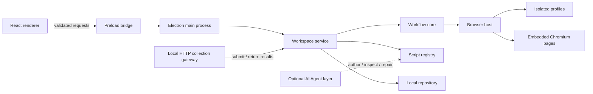

# Mimesis

The full enterprise orchestration and portability scope, design requirements, module boundaries and acceptance gates are tracked in the [engineering plan](docs/engineering-plan.md).

[简体中文](README.zh-CN.md) · English

Mimesis is a local-first, script-first browser automation desktop runtime built with Electron. It turns real browser sessions into isolated automation instances that can navigate websites, run reusable scripts, retain account state, and produce structured results.

AI is an optional authoring and recovery layer. A published script should continue to run without a model unless it explicitly declares an AI step.

> Mimesis is currently an early foundation release. The desktop execution path and authenticated local HTTP gateway work, including a durable queue and result archives. General-purpose script sandboxing, the account vault, concurrent scheduling, delivery connectors, and Agent runtime are still planned.

## Product model

- **Instance-oriented:** each automation instance owns its script, browser profile, target, configuration, and run history.
- **Real browser runtime:** automation and manual takeover share an embedded Chromium page.
- **Isolated profiles:** Electron session partitions keep cookies and site storage separated by profile.
- **Workflow-first:** schema-validated JSON collection recipes are executable today; a general TypeScript / JavaScript sandbox is planned.
- **AI-optional:** AI can help write, inspect, and repair scripts without becoming a hidden runtime dependency.
- **Structured delivery:** runs are designed to return validated data that can later be exposed through APIs, webhooks, or connectors.

## What works today

- Frameless monochrome Electron interface
- Multiple automation instances with individual configuration and history
- Persistent browser profiles backed by isolated Electron sessions
- Embedded Chromium content through `WebContentsView`
- A bundled page-inspector script for navigation and structured DOM extraction
- Run lifecycle events, cancellation, timeout handling, and the latest 50 run records
- SQLite transactions in a dedicated worker, normalized runtime tables, and backed-up legacy JSON migration
- Custom storage directory in Preferences, with verified copying on next launch and the original workspace retained
- Authenticated local HTTP gateway with idempotent submission, queuing, cancellation, and restart recovery
- Per-instance gateway job archives and cleaned JSON, CSV, and NDJSON exports
- Simplified Chinese and English UI resources
- Narrow preload bridge, validated IPC contracts, renderer sandboxing, and navigation guards

## Architecture



The renderer never receives direct Node.js, filesystem, session, or unrestricted browser access. Privileged browser resources stay in the Electron main process and are exposed through small, validated contracts.

More detail is available in [the architecture document](docs/architecture.md) and [the script-system design](docs/script-system.md).

See [the local gateway guide](docs/gateway.md) for configuration, API examples, storage layout, and current capacity limits.

UI changes follow the [V3 collection workspace design](docs/design/workflow-v3/design.md), generated before implementation. Horizontal navigation and a single full-width workspace replace the V2 sidebar composition. Native recording, editable initialization actions, field extraction, pagination loops and input parameters now execute through the same desktop and gateway runtime. See the [collection guide](docs/collection-workflows.md) for the verified two-page Quotes experiment and remaining limitations.

## Technology

- Electron 44
- React 19
- TypeScript 7
- Vite 8
- pnpm workspaces
- Zod contracts
- i18next
- Vitest and Playwright
- Biome

## Requirements

- Node.js `>= 24.19.0`
- pnpm `>= 12.3.4`
- Windows is the current primary development target

## Getting started

```bash
git clone https://github.com/Spark-Relics/Mimesis.git
cd Mimesis
corepack enable
pnpm install
pnpm dev
```

`pnpm dev` starts the Vite renderer, watches the Electron main and preload bundles, and launches the desktop window.

## Commands

| Command | Purpose |
| --- | --- |
| `pnpm dev` | Start the complete desktop development environment |
| `pnpm dev:web` | Start only the renderer in a browser |
| `pnpm build` | Build main, preload, and renderer bundles |
| `pnpm start` | Launch the previously built desktop application |
| `pnpm check` | Run type checking, lint rules, tests, and production builds |
| `pnpm test` | Run unit tests |
| `pnpm test:e2e` | Run Electron end-to-end tests |
| `pnpm package` | Produce an unpacked application with electron-builder |

This repository uses pnpm exclusively. Do not generate or commit `package-lock.json`.

## Repository structure

```text
Mimesis/
├─ apps/
│  └─ desktop/              Electron main, preload, and React renderer
├─ packages/
│  ├─ browser-host/         Privileged WebContentsView and profile adapter
│  ├─ contracts/            IPC schemas and shared domain contracts
│  ├─ i18n/                 Locale resources and formatting helpers
│  ├─ script-registry/      Published script definitions
│  ├─ script-sdk/           Restricted script-facing contracts
│  ├─ storage/              Validated local workspace persistence
│  ├─ ui/                   Reusable UI primitives and styles
│  └─ workflow-core/        Framework-independent run state machine
├─ scripts/                 Development, build, and validation scripts
├─ tests/                   Unit and Electron end-to-end tests
└─ docs/                    Architecture and script-lifecycle designs
```

## Security boundaries

- Renderer processes use `sandbox: true`, `contextIsolation: true`, and `nodeIntegration: false`.
- The preload exposes a narrow typed bridge instead of Electron primitives.
- IPC payloads and responses cross schema-validated boundaries.
- Remote pages run in separate `WebContentsView` instances and never receive workspace APIs.
- Browser permissions and unexpected window creation are denied by default.
- Navigation currently accepts only HTTP, HTTPS, and the built-in demo URL.

The current profile partition provides browser-session isolation. It is not a virtual machine and should not be treated as a complete security boundary for arbitrary untrusted code. A dedicated restricted script runtime is part of the planned architecture.

## Roadmap

- General-purpose versioned script projects and restricted execution sandbox
- Account pool, profile leases, credential vault, and controlled cookie import/export
- Schedules, queues, retries, checkpoints, and richer run evidence
- Remote gateway, webhooks, and output connectors
- AI Agent adapters for script authoring, page observation, diagnosis, and bounded repair
- Permission manifests, budgets, audit events, and approval policies
- Cross-platform packaging and update delivery

## Development rules

Keep reusable logic in packages, keep renderer copy inside the i18n resources, and preserve the trust boundary between the UI and Electron main process. Run the complete validation suite before submitting changes:

```bash
pnpm check
```
