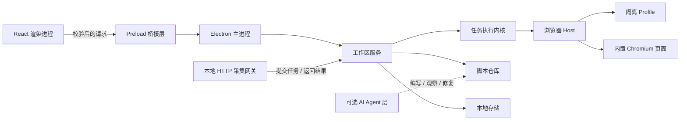

# Mimesis

简体中文 · [English](README.md)

Mimesis 是一个本地优先、脚本优先的 Electron 浏览器自动化桌面运行时。它把真实浏览器会话组织成相互隔离的自动化实例，让每个实例可以访问网站、执行可复用脚本、保留账号状态并输出结构化结果。

AI 是可选的脚本开发和故障恢复能力。除非脚本明确声明 AI 步骤，否则发布后的脚本不依赖模型也应当能够独立运行。

> Mimesis 目前处于早期框架阶段。桌面执行链路及带鉴权的本地 HTTP 网关已可用，支持持久化队列和结果归档；通用脚本沙盒、账号凭据保险箱、高并发调度、结果连接器和 Agent 运行时仍在规划中。

项目按完整的企业级可编排便携网关范围研发，模块闭环、设计标准与实际进度统一记录于[研发验收计划](docs/engineering-plan.md)。

## 产品模型

- **以实例为中心：** 每个自动化实例拥有自己的脚本、浏览器 Profile、目标地址、配置和运行记录。
- **真实浏览器运行时：** 自动化与人工接管操作同一个内置 Chromium 页面。
- **Profile 隔离：** 使用 Electron Session 分区隔离不同 Profile 的 Cookie 和站点存储。
- **流程优先：** 当前执行经过校验的 JSON 采集流程；通用 TypeScript / JavaScript 沙盒尚未实现。
- **AI 可选：** AI 可以辅助编写、观察和修复脚本，但不会成为隐藏的运行依赖。
- **结构化交付：** 运行结果按结构化数据设计，后续可通过 API、Webhook 或连接器提供给外部系统。

## 当前已经实现

- 无边框 Electron 桌面界面，顶部导航与单列工作区
- 多个自动化实例，以及各自的配置和运行记录
- 基于独立 Electron Session 的持久化浏览器 Profile
- 使用 `WebContentsView` 承载内置 Chromium 页面
- 内置页面检查脚本，可完成导航和结构化 DOM 信息提取
- 真实点击与输入录制，可编辑顺序、等待步骤和参数占位符
- 每个实例保存可执行 JSON 流程：初始化、字段提取、翻页循环、去重和有界停止
- 运行状态事件、取消、超时处理，以及最近 50 条运行记录
- 独立工作线程中的 SQLite 事务、运行数据分表、旧 JSON 原文备份与迁移
- [自定义存储位置](docs/storage-location.md)：设置页选择目录，下一次启动复制校验，保留原数据及浏览器会话
- 离线工作区备份/恢复：逐文件 SHA-256 校验与回执，恢复到新目录，绝不覆盖现有工作区
- 网关保留清理：历史终态任务超过 1000 条或归档超过 2 GiB 时从最旧开始清理，删除失败不虚报成功
- 本地 HTTP 网关：Bearer 鉴权、幂等提交、排队、取消及重启恢复
- 按实例保存网关任务与原始结果，清洗后导出 JSON、CSV 和 NDJSON
- 简体中文和英文界面资源
- 收窄的 preload 桥接、IPC 参数校验、渲染进程沙盒和导航限制

## 架构



渲染进程不会直接获得 Node.js、文件系统、Session 或无限制的浏览器权限。高权限浏览器资源保留在 Electron 主进程中，只通过范围明确并经过校验的接口开放。

详细设计参见[架构文档](docs/architecture.md)和[脚本系统设计](docs/script-system.md)。

外部程序接入方式、启动配置、API 示例和当前容量限制见[本地采集网关](docs/gateway.md)。

界面开发遵循[采集工作区 V3 设计](docs/design/workflow-v3/design.md)：先生成设计图，再实现顶部导航与单列工作区。V3 替代 V2 的侧栏布局。实际操作与可复用循环配置见[录制与采集指南](docs/collection-workflows.md)。

## 技术栈

- Electron 44
- React 19
- TypeScript 7
- Vite 8
- pnpm workspaces
- Zod 数据契约
- i18next
- Vitest 与 Playwright
- Biome

## 环境要求

- Node.js `>= 24.19.0`
- pnpm `>= 12.3.4`
- 当前以 Windows 作为主要开发目标

## 快速开始

```bash
git clone https://github.com/Spark-Relics/Mimesis.git
cd Mimesis
corepack enable
pnpm install
pnpm dev
```

`pnpm dev` 会启动 Vite 渲染进程、监听 Electron 主进程与 preload 构建，并打开桌面窗口。

## 常用命令

| 命令 | 用途 |
| --- | --- |
| `pnpm dev` | 启动完整桌面开发环境 |
| `pnpm dev:web` | 仅在浏览器中启动渲染界面 |
| `pnpm build` | 构建主进程、preload 和渲染进程 |
| `pnpm start` | 启动已经构建的桌面应用 |
| `pnpm check` | 执行类型检查、代码规范、测试和生产构建 |
| `pnpm test` | 执行单元测试 |
| `pnpm test:e2e` | 执行 Electron 端到端测试 |
| `pnpm package` | 使用 electron-builder 生成未打包应用目录 |

本仓库只使用 pnpm，请勿生成或提交 `package-lock.json`。

## 目录结构

```text
Mimesis/
├─ apps/
│  └─ desktop/              Electron 主进程、preload 和 React 渲染进程
├─ packages/
│  ├─ browser-host/         WebContentsView 与 Profile 高权限适配层
│  ├─ contracts/            IPC Schema 与共享领域契约
│  ├─ i18n/                 多语言资源与格式化工具
│  ├─ script-registry/      已发布脚本定义
│  ├─ script-sdk/           面向脚本的受限接口契约
│  ├─ storage/              带校验的本地工作区存储
│  ├─ ui/                   可复用 UI 基础组件与样式
│  └─ workflow-core/        与界面框架无关的运行状态机
├─ scripts/                 开发、构建与校验脚本
├─ tests/                   单元测试和 Electron 端到端测试
└─ docs/                    架构与脚本生命周期设计
```

## 安全边界

- 渲染进程启用 `sandbox: true` 和 `contextIsolation: true`，同时关闭 `nodeIntegration`。
- preload 只暴露类型明确的窄接口，不直接开放 Electron 原语。
- IPC 请求通过 Schema 校验后才能进入主进程能力层。
- 远程网页运行在独立 `WebContentsView` 中，无法获得工作区管理接口。
- 默认拒绝网页权限申请和非预期的新窗口创建。
- 当前只允许 HTTP、HTTPS 和内置示例地址导航。

当前 Profile 分区提供的是浏览器会话隔离，不等同于虚拟机，也不能作为任意不受信代码的完整安全边界。独立的受限脚本运行时属于后续架构的一部分。

## 路线图

- 通用的版本化脚本项目与受限执行沙盒
- 账号池、Profile 租约、凭据保险箱和受控 Cookie 导入导出
- 定时任务、队列、重试、检查点和更完整的运行证据
- 远程网关、Webhook 和结果连接器
- 用于脚本编写、页面观察、故障诊断和受限修复的 AI Agent 适配层
- 权限 Manifest、预算、审计事件和审批策略
- 跨平台打包与自动更新

## 开发约定

可复用逻辑应放在 packages 中，渲染层文案统一进入 i18n 资源，并保持 UI 与 Electron 主进程之间的信任边界。提交改动前请执行完整校验：

```bash
pnpm check
```
