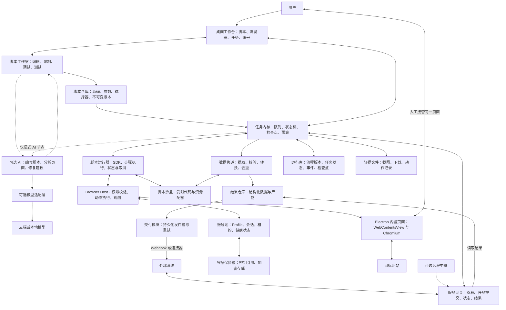
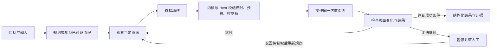

# Electron 浏览器自动化与 AI Agent 平台架构设计

版本：0.2 · 日期：2026-09-06 · 状态：架构提案，尚未实现。当前方向：脚本优先，AI 按需参与开发或运行。

本方案按本地桌面优先、单机运行、Windows 首发规划，模块边界保留跨平台扩展能力。核心目标：用户独立或配合 AI 编写浏览器脚本，调试通过后发布为可重复执行、可被外部系统调用的服务。用户、脚本与可选 AI 操作同一内置浏览器环境。纯脚本任务无需配置模型或调用 AI；访问目标网站仍需要相应网络连接。

## 1. 架构决策

1. **浏览器是执行环境。** 页面交互、导航、下载和当前页面产生的网络响应构成采集主路径。独立 HTTP 连接器作为明确配置的扩展。
2. **用户与执行器共享页面，控制权互斥。** 任务暂停后，用户可以在原页面登录、处理弹窗或纠正操作；恢复时由脚本重新定位并验证状态，显式启用的 Agent 任务才调用 AI 观察。
3. **脚本是核心资产，AI 是可选能力。** 人工编码、AI 辅助编写与录制生成的脚本，都保存为可编辑、可导出、可版本化的项目；发布后按固定版本独立运行。
4. **主进程持有浏览器资源。** 脚本和可选 Agent 通过同一受限 SDK 申请操作；只有主进程 Browser Host 持有 WebContents、Session 和调试协议连接。
5. **账号对应完整 Profile。** Cookie 快速切换在产品中体现为账号环境切换，底层保留完整站点存储和会话生命周期。
6. **脚本运行器不依赖 Agent。** 调度、取消、检查点、超时、账号租约、提取和结果交付均可在未配置模型时工作；只有显式 AI 节点才具有模型依赖。
7. **本地内核与远程入口分开。** 本机 API 是基础能力；局域网或云系统访问通过可选网关接入。桌面离线时，正在该设备上执行的任务无法继续。

## 2. 总体设计图

这是逻辑模块图，节点不代表全部需要独立部署；进程归属见下一节。实线表示主要调用及数据流，虚线表示可选扩展。



结果仓库到交付模块的箭头表示可交付结果；实现时由数据管道在结果提交事务中写入发件箱，交付进程读取待发记录，数据库本身不主动发起消息。

## 3. 进程与信任边界

| 位置 | 负责的内容 | 边界 |
| --- | --- | --- |
| Electron UI Renderer | 脚本编辑、元素选择、步骤调试、任务列表、可选 AI 对话、账号管理 | 只调用窄化的 preload API，不直接访问 Node、数据库或其他页面 |
| Electron Main / Browser Host | 窗口与视图、Profile、会话租约、CDP 连接、动作授权、凭据注入 | 可信组件；不运行模型生成的任意 Node 代码，不承担耗时推理与数据加工 |
| Core Worker / Script Runner | 网关、调度、脚本版本加载、SDK 调用协调、检查点、数据管道、存储与交付 | 可信应用代码；用户源码进入受限运行时；不加载 Agent 也能运行纯脚本；单一数据库写入协调者 |
| Agent Worker（可选） | 开发期生成与修改脚本；显式 AI 节点的页面理解和决策 | 生成代码作为草稿；按需启动；发布的纯脚本不依赖此进程 |
| Chromium 页面进程 | 任意网站页面和脚本 | 不可信内容；关闭 Node 集成，启用 contextIsolation 和 sandbox，不暴露应用管理接口 |
| Script Sandbox | 用户或 AI 编写的浏览器编排脚本、提取和数据转换代码 | 使用独立受限运行时；经序列化异步桥接调用 SDK；不能直接访问宿主 Node、文件或网络 |

`WebContentsView` 和 `Session` 由 Electron 主进程管理。工作进程可采用 `utilityProcess`，它提供 Node.js 子进程和消息端口，但不能据此认定其中的任意代码受到安全隔离。[WebContentsView 文档](https://www.electronjs.org/docs/latest/api/web-contents-view)、[utilityProcess 文档](https://www.electronjs.org/docs/latest/api/utility-process)。

视图与操作系统进程不是固定的一对一关系；站点、子框架等进程由 Chromium 管理。Profile 分区提供会话与存储隔离，不等于独立虚拟机或独立浏览器指纹。

## 4. 浏览器执行内核

### 4.1 浏览器宿主

工作台采用可信的本地 UI 加独立 `WebContentsView` 承载远程网站。Host 管理 tabId、webContentsId、profileId、当前文档版本、所属任务及控制权。

自动化始终指向当前内置页面。操作前在新鲜观察中定位元素，滚动到可见区域，检查遮挡和可用状态，再发送鼠标或键盘输入；操作后等待指定条件并校验变化。仅延迟若干秒不能代表操作完成。

底层优先验证 `webContents.debugger` 提供的 Chromium DevTools Protocol 通道，封装 DOM、Accessibility、Page、Input、Network、Target 等能力；按打包版本建立兼容矩阵。模型不直接接触原始 CDP，也不获得通用 JavaScript 执行工具。[Electron Debugger 文档](https://www.electronjs.org/docs/latest/api/debugger)。

`sendInputEvent` 可作为前台输入适配方式，其官方要求包含页面的 BrowserWindow 获得焦点。后台执行不能建立在所有页面同时获得焦点的假设上，必须验证 CDP 输入、后台节流、截图、最小化和窗口隐藏的组合行为。[webContents 输入文档](https://www.electronjs.org/docs/latest/api/web-contents#contentssendinputeventinputevent)。

打开 DevTools 可能使现有 debugger 连接脱离，因此一个页面只设一个调试连接管理器：统一复用观测与控制通道；连接断开时暂停动作、重新附着并刷新观察，无法恢复则进入人工处理。

Playwright 可用于端到端测试，或后续实现一个 Driver 适配器；官方 Electron 支持仍标注为实验性，所以在验证 WebContentsView、子框架和弹窗行为前，不将它作为产品唯一执行路径。[Playwright Electron 文档](https://playwright.dev/docs/api/class-electron)。

### 4.2 三种互补的定位与采集方式

| 方式 | 用途 | 校验要求 |
| --- | --- | --- |
| DOM / 可访问性语义定位 | 按名称、角色、标签、列表结构定位与提取 | 检查唯一性、可见性、所属 frame、文档版本 |
| 截图与视觉定位 | Canvas、自绘控件、语义信息不足的区域 | 坐标绑定截图、视口、缩放和设备比例；页面变化后重新定位 |
| 当前会话的网络观测 | 捕获浏览器操作产生的结构化响应 | 按任务、页面、接口范围过滤；移除认证头等敏感字段 |

多标签、popup、新窗口、下载、上传、对话框、跨域 iframe、Shadow DOM 和长列表虚拟滚动都属于 Driver 的适配职责。第一阶段先覆盖普通页面与常见弹窗，复杂目标按能力表逐项支持，失败返回结构化原因。

“模仿用户行为”的工程目标是遵循真实交互顺序、页面状态和会话上下文；Electron 的内置 Chromium 并不保证与普通 Chrome 在所有站点上完全一致，也不保证免于验证码或访问限制。

## 5. 账号池与 Cookie 快速切换

建议的实体关系是 `Account → Profile → Session → Tabs`。同一账号允许建立多个明确命名的环境，但默认一个可写 Profile 同时租给一个任务。

Profile 保存站点范围、分区标识、浏览器存储位置、账号状态、可选代理配置和最后验证时间。密码、模型 API Key、Webhook 签名密钥单独进入凭据保险箱；任务只保存 secretRef。

持久化会话使用例如 `persist:profile-<uuid>` 的分区标识；临时会话不带 `persist:`。同分区共享会话，不同账号应使用不同分区。[Electron Session 文档](https://www.electronjs.org/docs/latest/api/session)。

账号切换流程：

1. 暂停原账号的自动化，取消未发出的动作，保存任务检查点。
2. 校验目标账号是否可用，取得其 Profile 租约。
3. 展示或新建绑定目标 Session 的 WebContentsView。
4. 通过页面中的账号标识验证实际身份，再继续任务。

现有 WebContents 的会话在创建时确定；切换应选择或创建目标 Profile 的页面。不要把运行中的账号 A 页面直接替换为账号 B 的一组 Cookie。

Cookie 导入与导出仍然提供，但只是兼容工具。LocalStorage、IndexedDB、服务端会话和设备绑定可能影响登录；导入后必须验证。环境热保留支持快速切回，冷环境关闭页面节省内存，但不能承诺恢复全部内存状态。

Profile 租约具有心跳、到期时间与递增 fencing token。Host 在每次动作时校验 token，防止旧工作进程恢复后继续控制已经分配给新任务的会话。人工接管也取得同一控制权；超时回收须先隔离旧执行者。

凭据加密可使用操作系统密钥保护机制，Electron `safeStorage` 是适配入口之一；Windows 下它不隔离同一用户身份运行的其他程序。浏览器 Profile 的全部存储也不会因使用 `safeStorage` 自动获得应用级加密。[safeStorage 文档](https://www.electronjs.org/docs/latest/api/safe-storage)。

## 6. 脚本与 AI 协作架构

### 6.1 脚本项目与发布机制

脚本工作室是第一版核心入口。用户可以直接写 JavaScript/TypeScript，也可以从录制、模板或 AI 生成的草稿开始；支持外部编辑器修改后导入。内置 AI 未配置时，编辑、调试、发布和纯脚本运行均可使用。

脚本项目包含入口源码、Manifest、输入输出 Schema、选择器、样例输入及测试样本。支持条件、循环、分页、模块复用、异常处理和字段转换。受限 SDK 负责浏览器、账号绑定、日志、检查点和产物；导入依赖需列入允许范围并固定版本。详细约定见 [脚本系统设计](script-system.md)。

生命周期为 `草稿 → 调试 → 测试 → 发布版本 → 手动/定时/API 运行 → 维护新版本`。运行绑定不可变版本及输入快照；修改草稿不影响正在执行的任务。发布包记录源码、SDK 和依赖版本及内容摘要，可回滚。

每个脚本声明 AI 策略，默认 `disabled`。纯脚本的构建、加载、定位、等待、提取、验证和执行恢复均不得隐式依赖模型。运行时拒绝未经声明的模型能力调用。混合脚本明确标记 AI 节点、预算和模型不可用时的处理方式。

调试器首版提供 SDK 步骤级单步、断点、输入与输出查看、元素高亮及浏览器接管。任意源码行断点和 TypeScript source map 调试另行验证，不能将步骤调试等同于完整 IDE 调试器。

### 6.2 可选 Agent 模块

开发阶段，AI 可以读取用户选择的页面观察、源码和日志，提出代码修改，由用户检查差异后保存、调试和发布。纯脚本执行失败后按既定策略重试、停止或转人工，默认不自动唤起 AI。

探索任务或显式 AI 节点可采用受任务状态机约束的 Agent 循环。以下角色是可替换的逻辑模块，可以在同一 Agent Worker 中按需调用，不要求每步启动多个独立 Agent。

| 模块 | 输入 | 输出 |
| --- | --- | --- |
| Planner | 用户目标、输入参数、已发布流程、权限与预算 | 有边界的任务计划、成功条件、必要参数 |
| Observer | 页面状态、DOM 摘要、可访问性信息、截图、相关响应 | 带时间与文档版本的 Observation |
| Controller | 当前计划、Observation、动作历史 | 一个或少量受约束的工具调用候选 |
| Extractor | 页面证据和字段定义 | 带来源引用的候选结构化数据 |
| Verifier | 动作前后状态、提取结果、成功条件 | 通过、重观察、有限修复或人工介入 |
| Skill Registry | 站点特征、流程版本、已验证定位器 | 可复用的操作步骤和站点能力 |



### 6.3 共用工具协议

暴露 `browser.observe`、`navigate`、`click`、`type`、`scroll`、`pressKey`、`waitFor`、`extract`、`download`、`requestHuman` 等任务能力。动作通过协议层映射到驱动实现。

每次调用包含 `runId`、`stepId`、`actionId`、`profileId`、`tabId`、`frameId`、`documentEpoch`、`leaseToken`、`timeoutMs` 和声明式目标。身份及权限来自经认证的进程通道和运行上下文，不信任模型填写的标识。

纯脚本使用持久化的选择器及显式等待条件，在每步执行时重新解析目标，无需 AI Observation。AI 动作的临时元素引用来自最近一次 Observation。导航、frame 重建或显著页面变化后，旧元素句柄和截图坐标失效。工具返回标准化状态、页面变化、错误类别和证据引用。

密码输入使用专门的凭据填充能力：Agent 只选择已授权 secretRef 和目标字段，由 Host 获取秘密后注入；不在观察、日志或模型上下文中返回密码及原始 Cookie。

### 6.4 使用模式

- **纯脚本模式（默认）：** 用户自行编写或导入脚本；固定规则定位、操作、提取和验证，全程无需 AI。
- **AI 辅助开发：** AI 配合编写、调试和维护脚本，成果经测试发布后按纯脚本运行。
- **录制与教学：** 人工操作生成可编辑步骤和初始脚本，录制本身不依赖 AI；可选 AI 协助补全参数化与异常处理。
- **混合运行（显式启用）：** 在固定脚本中仅对指定步骤调用 AI，例如语义分类；输出契约明确其依赖和失败处理。
- **Agent 探索（可选扩展）：** 用户描述目标，AI 逐步观察和执行，成功后可辅助整理为脚本草稿。

用户主动启动或预先明确启用的 AI 修复仅在原任务范围与预算内尝试。修复成功生成候选脚本版本，保留差异和证据；默认不自动覆盖已发布版本。数据输出需要确定性的 Schema 校验以及字段来源，缺失值按契约标记为空或报错，不能让模型补造事实。

模型适配层支持可配置供应商和本地模型；按结构化输出、视觉理解和工具调用能力匹配。预算覆盖最大动作数、耗时、Token、费用和修复次数。业务事实和任务状态保存在运行库中，不依赖无限增长的对话历史。

网页内容、响应正文和下载文件作为外部数据输入；其中的“指令”不能修改任务目标、扩大站点范围或授予工具权限。模型与人工操作都遵守任务预先配置的能力策略，常规已授权动作不反复打断；未配置的外部写入或破坏性操作转为明确的人工处理节点。

## 7. 沙盒与权限机制

需要区分四个边界：

| 边界 | 机制 | 保护范围 |
| --- | --- | --- |
| 网页沙盒 | Chromium sandbox、contextIsolation、禁用 Node 集成 | 隔离远程页面与应用特权接口 |
| 账号隔离 | Session 分区、Profile 租约、任务绑定 | 防止账号数据混用与并发争用 |
| 任务隔离 | 独立执行上下文、预算、超时、受限工具 | 约束任务对浏览器、文件和连接器的访问 |
| 脚本隔离 | 独立受限运行时与宿主能力白名单 | 执行浏览器编排及数据转换代码；统一通过 SDK 调用外部能力 |

Electron 主进程是可信特权边界。页面开启 `sandbox` 不会自动保护主进程或用户脚本；所有 IPC 需要校验来源、参数及所属任务。[Electron 安全文档](https://www.electronjs.org/docs/latest/tutorial/security)、[进程沙盒文档](https://www.electronjs.org/docs/latest/tutorial/sandbox)。

首版必须包含脚本执行能力。P0 验证独立 WASM 或嵌入式 JS 受限运行时，支持约定范围内的 JavaScript、构建时编译的 TypeScript、Promise 与浏览器 SDK 异步桥接。运行时选型须验证禁止任意宿主模块加载、文件和网络默认无权限、CPU/内存/时间限额、可强制终止，以及脚本取消时撤销未执行的浏览器动作。声明式字段映射节点可以同时提供，但不能替代用户直接维护源码的入口。该机制完成前不开放任意 Node/Python 宿主执行。

`node:vm` 不是安全沙盒；普通子进程也不能单独作为不可信插件的权限边界。[Node.js VM 文档](https://nodejs.org/api/vm.html)。如果未来支持完整 Node/Python 插件，需要另建操作系统级隔离 Worker，并针对 Windows、macOS、Linux 分别验证能力限制。

任务 Manifest 声明允许的站点及跳转、账号范围、上传与下载目录、连接器、数据外发目标和写入能力。网络目的地与重定向按策略校验。页面权限、弹窗及外部协议统一经 Host 处理；本地 UI 管理接口不暴露给目标网站。

## 8. 任务内核与恢复

脚本版本包含源码产物、Manifest、输入输出 Schema、默认账号选择、权限、预算、重试策略、输出映射和 SDK 兼容版本。流程可组合多个脚本及导航、交互、提取、条件、循环、等待、人工处理、可选 Agent、转换和交付节点。

任务状态建议为 `queued → acquiring_profile → running → validating → succeeded`，并包含 `waiting_human`、`retry_wait`、`failed`、`cancelled`、`interrupted`。人工处理占用 Profile 控制权，但不占用活跃 AI 推理并发。

每个动作记录动作意图、发送状态、观测证据和结果。检查点保存脚本显式提交的业务位置、可序列化变量、当前 URL 和恢复条件。恢复时重新调用入口或恢复函数，由脚本读取检查点并重新定位、验证登录；不恢复任意 JavaScript 调用栈、闭包或网页堆内存，也不要求 AI 参与恢复。

只读操作按策略重试。提交表单等外部副作用存在“网站已执行但本地尚未记账”的窗口，不能直接回放；恢复时先检查目标站点状态，无法确认则转人工核对。客户端请求幂等键只能避免重复建任务，不能保证网站动作恰好执行一次。

并发同时受总页面数、每个站点、每个账号和内存压力限制。初始并发保持保守，通过真实目标网站压测后调整。页面崩溃、断网、系统休眠、退出应用都必须转为可解释状态并释放或隔离资源。

## 9. 任意形式的输出与外部系统接入

结果统一经过 `原始证据 → 提取 → 字段校验 → 转换 → 输出契约 → 交付`。输出配置包含字段重命名、嵌套结构、列表、日期与数值格式、空值规则、状态码、Content-Type 和交付目的地。

建议的 API 契约：

| 接口 | 行为 |
| --- | --- |
| `POST /v1/services/:serviceId/runs` | 传入参数及幂等键，创建指定服务版本的任务，通常返回 `202` 与 runId |
| `GET /v1/runs/:runId` | 查询状态、进度、结构化错误和是否需要人工处理 |
| `GET /v1/runs/:runId/result` | 完成后返回契约定义的结果；执行中返回明确的未完成状态 |
| `POST /v1/runs/:runId/cancel` | 请求取消，并返回取消处理状态 |
| `GET /v1/runs/:runId/events` | 用 SSE 提供进度事件 |

短任务可配置有限的同步等待，超时转为异步查询；浏览器采集不应强制维持长时间 HTTP 请求。

JSON、CSV、HTML/XML、文件及连接器使用不同序列化器。动态 HTML 按目标上下文转义。Webhook 从持久化发件箱发送，带事件 ID、签名和重试策略；接收方按事件 ID 去重，交付失败不重复运行采集任务。

默认 API 监听回环地址并鉴权，校验 Host/Origin 和请求范围。局域网访问需启用对应监听及 TLS 策略。云系统可以通过可选中继向桌面分配任务，桌面主动建立出站连接；云端返回设备离线或排队状态，不把桌面 API Key 或浏览器调试端口直接暴露在公网。

“任意响应形式”通过可扩展序列化器和连接器实现；第一版先覆盖常用格式，特殊协议通过插件适配。

## 10. 数据模型与模块布局

| 实体 | 主要内容 |
| --- | --- |
| Account / Profile | 账号元数据、分区、会话位置、健康状态、secretRef |
| WorkflowVersion / PublishedService | 不可变流程版本、输入输出 Schema、发布及调用配置 |
| ScriptProject / ScriptVersion | 草稿源码、Manifest、选择器、固定依赖、SDK 版本、构建产物及内容摘要 |
| Run / StepAttempt | 输入快照、版本、状态、动作意图、错误及预算消耗 |
| ProfileLease | 租用任务、心跳、到期时间、fencing token |
| Observation / Artifact | 页面摘要、截图、frame 信息、时间、证据路径与摘要 |
| Result / Delivery | 结果、来源、交付状态、重试计数、幂等标识 |
| Secret / CapabilityPolicy | 加密凭据及任务能力策略 |

单机结构化数据可采用 SQLite；截图、下载文件和大型响应放在受控文件目录，数据库保存索引、校验摘要和留存信息。原始 Cookie、登录令牌和凭据不进入普通任务事件。截图和响应支持字段遮盖及配置化留存。

建议的代码边界如下，具体框架版本在技术验证后锁定：

```text
apps/desktop/               Electron 主进程、preload、桌面 UI
packages/script-studio/    编辑器、录制、元素选择、步骤调试、差异检查
packages/script-sdk/       浏览器、日志、状态、产物等受限异步能力
packages/script-runtime/   脚本加载、版本校验、执行、取消、能力代理
packages/script-registry/  脚本项目、不可变发布版本、导入导出
packages/contracts/        IPC、工具、任务、Schema、错误协议
packages/browser-host/     页面、CDP、Profile、控制权及能力校验
packages/workflow-core/    状态机、调度、检查点、预算、恢复
packages/agent-runtime/    Agent 循环、上下文、模型适配
packages/data-pipeline/    提取、验证、映射、序列化
packages/script-sandbox/   受限代码运行时与能力代理
packages/service-gateway/  API、鉴权、SSE、可选中继适配
packages/connectors/       Webhook、文件及数据库交付
packages/storage/          运行库、发件箱、证据索引
packages/site-skills/      已验证站点流程及适配元数据
```

前后端协议优先使用 TypeScript 和版本化 Schema；UI 框架可以独立选择，运行内核不依赖特定画布组件、Agent SDK 或模型厂商。

## 11. 实施顺序与验收

| 阶段 | 范围 | 验收标准 |
| --- | --- | --- |
| P0 浏览器与脚本技术验证 | 内置页面、CDP、两个账号环境、最小受限 JS 运行时、异步 SDK | 未配置模型时脚本可点击、输入、等待、提取；验证后台、缩放、弹窗、DevTools 断开、终止和越权拦截 |
| P1 纯脚本业务闭环 | 源码编辑、输入输出定义、选择器、步骤调试、发布版本、持久化任务、JSON API | 完全不配置模型，手写脚本完成采集；外部系统调用固定版本并收到结果；支持取消、失败日志和版本回滚 |
| P2 开发辅助 | 录制转脚本、测试样本、外部编辑器导入、AI 代码生成与修复建议 | 用户可检查并修改生成代码；发布后关闭模型仍可重跑纯脚本；普通失败不自动调用 AI |
| P3 平台能力 | 账号池调度、定时任务、复杂输出、Webhook、脚本运行时强化 | 不串号；交付重试不重复采集；脚本显式检查点可恢复；资源和权限边界通过验证 |
| P4 扩展能力 | 插件协议、站点能力库、远程中继、多设备执行 | 版本兼容、可回滚、权限可解释；离线设备与任务归属清晰 |

P0 的结果决定 Driver、受限脚本运行时和 SDK 桥接的实现方式及首批支持网站范围。P1 构成首个无需 AI 的可试用版本，P2 增强开发体验，P3–P4 逐步补齐平台能力。运行期 Agent 探索独立排期；尚未测量前不承诺任意网站成功率、隐藏窗口可靠性、并发规模或开发周期。

建议选择三个用户实际要使用的目标网站作为首批样本：一个标准表单列表、一个动态页面、一个需要长期登录的业务系统。用任务成功率、人工介入率、P95 耗时、每次任务模型成本和账号失效率衡量进展。

## 12. 首个端到端示例

用户先在脚本工作室中独立或配合 AI 编写“采集商品信息”脚本，定义输入、选择器、翻页逻辑、输出字段及异常处理，调试通过后发布版本。外部系统传入 URL 和参数；网关锁定脚本版本并创建任务；内核获取账号环境；Script Runner 根据代码在内置页面中检索、翻页和提取，全程无需模型。每一步保留必要证据，数据管道校验结果后落库，外部系统得到约定 JSON 或带签名的 Webhook。

账号失效时任务进入人工处理，用户在同一内置页面重新登录；交回控制权后重新识别账号和页面状态，再从经过验证的步骤继续。Webhook 失败仅重试交付。

## 13. UI 与当前产品方向

主要入口为脚本工作室、浏览器环境、任务运行、账号管理、数据集与服务接口。脚本工作室采用源码与浏览器并排布局，提供选择器拾取、参数、步骤断点、试运行和发布；下方显示执行日志与结果。

AI 助手为可收起的开发辅助面板。执行纯脚本时标注“脚本运行中”和版本，默认显示实际步骤及日志；只有显式 AI 节点显示模型运行状态。脚本详情显示“无需 AI”或“含 AI 步骤”，让依赖一目了然。

现有 `design/ui-workbench-v1.png` 保留为早期浏览器工作台视觉参考，其常驻 AI 执行面板不作为默认运行模式。本次调整更新规划，尚未重绘该图片。

当前只有架构规划及 Mermaid 图源，没有创建 Electron 应用或执行上述验收测试。API 事实依据文中的官方文档；模块划分、数据模型、SDK 和阶段计划为本项目的设计建议。
