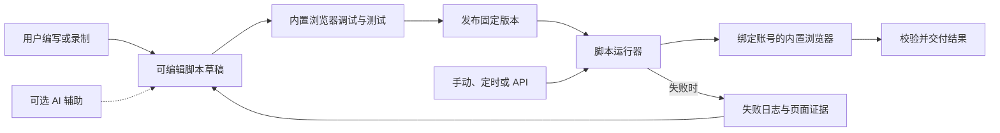

# 脚本系统设计

日期：2026-09-06 · 状态：提案，尚未实现。以 architecture.md 0.2 的脚本优先方向为准。

## 1. 产品工作方式

用户自己或配合 AI 完成脚本设计、编写、调试和测试，发布后由软件按代码独立执行。可以完全不配置内置 AI，使用外部编辑器或其他编码助手，再将源码导入工作台。



AI 默认只参与开发环节。纯脚本失败后按脚本与任务策略处理；用户可以查看失败证据，自行修改或主动请求 AI 协助，修改产物进入新草稿。

## 2. 每个脚本项目包含什么

```text
product-collector/
  manifest.json          身份、入口、SDK 兼容版本、权限、AI 策略
  src/main.ts            主入口；也支持 JavaScript
  src/parse.ts           可选的可复用解析函数
  selectors.json         按业务含义命名的定位规则
  input.schema.json      参数、类型、默认值和约束
  output.schema.json     返回结构与字段类型
  examples/input.json    可直接试运行的参数示例
  fixtures/              可选的脱敏页面、响应与预期输出
  README.md              登录要求、使用方法、常见失败原因
```

账号和密钥保存在平台环境中，项目只引用逻辑账号角色或 secretRef；源码可以导出和版本管理。发布产物包含构建后的代码、Schema、Manifest、依赖锁定信息和内容摘要。

默认支持包内模块与平台 SDK，额外依赖必须明确允许并固定版本。脚本协议、入口形式、错误格式及 SDK 兼容策略应在第一版确定；具体运行时和编辑器框架在 P0 验证后选定。

## 3. 默认的 AI 依赖契约

| 策略 | 执行行为 | 模型不可用时 |
| --- | --- | --- |
| `disabled`（默认） | 纯脚本；没有模型能力；不因失败自动调用 AI | 浏览器及脚本任务正常运行 |
| `explicit` | 仅指定步骤可以调用受限 AI 接口，必须定义预算与输出结构 | 按该节点声明的降级或失败策略处理，不虚报完成 |

开发期 AI 的使用不改变脚本运行策略。AI 编写的脚本只要不包含模型调用，也可以标记 `disabled`。

Manifest 概念示例，字段属于本项目拟定协议：

```json
{
  "id": "product-collector",
  "version": "1.0.0",
  "entry": "src/main.ts",
  "sdkVersion": "1",
  "inputSchema": "input.schema.json",
  "outputSchema": "output.schema.json",
  "ai": { "mode": "disabled" },
  "permissions": {
    "browserOrigins": ["https://catalog.example.com"],
    "profileRole": "catalog-reader",
    "externalConnectors": [],
    "downloads": false
  },
  "limits": { "timeoutMs": 120000, "maxActions": 200 }
}
```

`profileRole` 在任务配置中映射到具体 Profile。网关校验输入 URL，Host 在导航、重定向及相关能力调用时执行权限策略，脚本不能通过更换入参扩大账号或站点权限。

## 4. SDK 应提前统一的能力

| 能力 | 用途 |
| --- | --- |
| `ctx.browser` | 获取已租用环境中的页面，导航、定位、点击、输入、等待、读取 DOM、截图、下载 |
| `ctx.step` | 为步骤命名，记录输入输出、耗时和错误，支持步骤级断点与取消 |
| `ctx.state` | 保存可序列化的业务检查点，例如已完成页码与去重键 |
| `ctx.log` | 输出结构化日志，关联任务与步骤并脱敏 |
| `ctx.artifacts` | 保存受控目录中的证据和文件，返回产物引用 |
| `ctx.secrets` | 请求对已授权字段填充凭据，不返回原始密钥给脚本 |
| `ctx.ai` | 仅在 Manifest 为 explicit 且节点声明允许时可用 |

定位和提取采用固定规则时无需模型。页面变化导致规则失效，返回清晰错误与证据，便于人工或 AI 在开发阶段修复。

以下为拟定 SDK 的说明性示例，API 尚未实现，不是现成 Playwright 代码，也不能直接运行。网站、选择器和数据为示例：

```ts
export default async function run(ctx, input) {
  const page = await ctx.browser.page();

  await ctx.step("打开商品目录", async () => {
    await page.goto(input.url);
    await page.waitFor({ css: ".product-card", state: "visible" });
  });

  const items = await ctx.step("提取商品信息", async () => {
    return page.extractRows({
      row: { css: ".product-card" },
      fields: {
        name: { css: ".product-name", read: "text" },
        priceText: { css: ".product-price", read: "text" },
        stockText: { css: ".product-stock", read: "text" }
      }
    });
  });

  if (items.length === 0) {
    throw new Error("未找到商品，请检查页面或选择器");
  }

  return { sourceUrl: input.url, items };
}
```

分页循环、筛选条件、字段解析、去重与异常分支均可由普通代码表达。生产脚本还需定义结束条件、最大页数、登录状态校验、超时及站点适配测试。稳定逻辑无需改写为模型提示词。

## 5. 执行与恢复的明确约定

脚本入口接收平台上下文和经过 Schema 校验的输入，返回符合输出 Schema 的可序列化数据或产物引用。平台负责结果落库与交付，脚本无需自行保存 API Key 或重复实现 Webhook 重试。

源码在受限运行时内执行，浏览器能力通过异步桥接调用 Host。JavaScript 循环、Promise、异步取消及超时中断属于 P0 必测范围；TypeScript 只作为开发语言，经编译生成执行代码。

`ctx.step` 负责记录与步骤调试，不自动保证业务幂等，也不默认缓存或跳过有副作用的步骤。检查点由脚本显式提交并显式读取，崩溃恢复会重新进入脚本或其恢复入口。网站提交结果不确定时，先核验而非直接重放。

发布使用不可变版本。每次运行记录脚本版本、SDK 版本、输入快照、账号绑定、动作和结果；测试依赖固定样本与针对真实网站的试运行，不能把一次成功视为所有网站状态都适用。

## 6. 工作台操作闭环

1. 新建脚本：从空项目、站点模板、录制或 AI 草稿开始。
2. 绑定环境：选择测试账号和目标网站，不将登录秘密写入源码。
3. 编写与定位：源码编辑、元素拾取、选择器预览、参数和输出定义。
4. 试运行：单步、步骤断点、查看结果、日志及失败截图；AI 辅助按钮可选。
5. 测试与发布：校验输入输出与权限，检查修改差异，发布固定版本。
6. 使用：手动运行、配置定时任务或发布 API，均调用同一版本。
7. 维护：查看失败证据，更新草稿，重新测试并发布；必要时回滚服务绑定版本。

界面默认以脚本编辑、内置浏览器、参数和日志为核心。AI 面板可收起，开发动作包括“生成脚本”“解释报错”“建议修复”；运行面板显示“脚本运行中”、版本和真实步骤。

## 7. 首版必须验证的结果

- 不配置模型凭据、拒绝所有模型能力调用时，手写纯脚本仍能编辑、试运行、发布、被 API 调用并返回结果。
- AI 辅助生成的纯脚本关闭模型后仍能运行；包含 AI 步骤的脚本明确显示依赖。
- 修改草稿不改变已发布版本和正在运行的任务；回滚可追踪。
- 选择器失效产生步骤、原因、日志和截图，默认不会触发隐式 AI 调用。
- 相同脚本在不同账号环境中运行时，控制权与会话不会混用。
- 取消、脚本超时及工作进程失效后，旧执行者不能继续发送浏览器动作。
- 输入输出校验、权限边界、依赖限制及脚本显式检查点满足约定。

这些是设计验收条件，尚未实现或执行。
